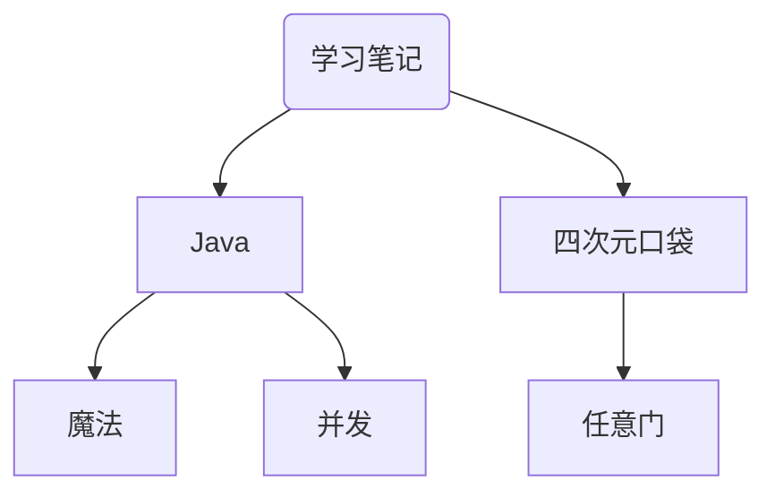

```mermaid
graph TB;
O(学习笔记)-->Java; 
Java-->魔法;
Java-->并发;
click Java "https://spectred.github.io/java/" "This is a link"
click 魔法 "https://spectred.github.io/java/magic/" "This is a link"
click 并发 "https://spectred.github.io/java/concurrent/" "This is a link"

O(学习笔记)-->四次元口袋; 
四次元口袋-->任意门;
click 任意门 "https://spectred.github.io/doraemon/tools.html" "This is a link"
```
